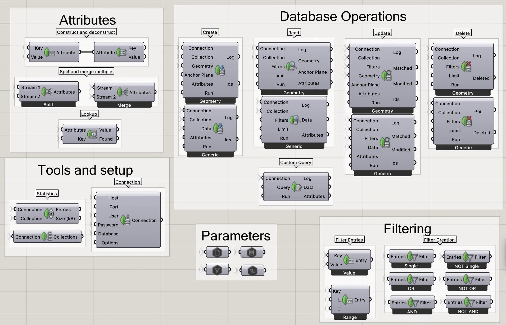

# MongoDB (Grasshopper Plugin)

A lightweight Rhino 8 / Grasshopper plugin that lets you **save, query, replace, and delete** Grasshopper data in **MongoDB** using a Grasshopper-friendly workflow (no raw JSON required). Targetted specifically for **Rhino 8 + Grasshopper**, `.NET 7` (`net7.0`).
The plugin was developed and used for a research project at the Amsterdam University of Applied Sciences, but is open source and available for anyone to use and continue to develop.



## Use Cases
- **Data persistence**: save geometry and data across sessions without relying on Rhino files or external formats.
- **Sharing**: multiple users can read/write to the same MongoDB collection for collaborative projects.
- **Metadata-driven workflows**: attach attributes to stored documents and query based on these attributes for dynamic data retrieval.

## Features

- **CRUD Operations** such as Save, Query, Replace, Delete for both Geometry and Generic typed data
- **Attributes system** to attach typed metadata under stored documents, with support for querying and filtering based on these attributes
- **Filter builder** to build safe query filters
	- Supports **regex** for string values: `re:<pattern>` or `/pattern/flags`
	- Supports **ranges** (`$gte`/`$lte`) via Range mode

## Installation
This plugin ships as a `.gha` plus dependency DLLs. Keep all files together.

### Windows (Rhino 8)
1. Unzip the distribution zip.
2. Copy/extract the contents into Grasshopper’s **Libraries** folder: `%%APPDATA%%\McNeel\Rhinoceros\8.0\Plug-ins\Grasshopper\Libraries`
3. Restart Rhino / Grasshopper.

### macOS (Rhino 8)

1. Unzip the distribution zip.
2. Copy/extract the contents into your Grasshopper **Libraries** folder. The default Rhino 8 GH Libraries directory typically lives under: `~/Library/Application Support/McNeel/Rhinoceros/8.0/Plug-ins/Grasshopper (...)/Libraries`
3. Restart Rhino / Grasshopper.

## Data Model (Stored Documents)

Documents are stored in a user-selected collection with a `type` discriminator.
Collections are schemaless and automatically created on first insert.

- Geometry documents:
	- `type: "geometry"`
	- `geom`: GH_Archive bytes (binary)
	- `geomType`: stored type name
	- `anchor`: plane (BSON) for reference
	- `bbox`: `{ min: [x,y,z], max: [x,y,z] }`
	- `attrs`: attributes document
	- `createdAt`: timestamp

- Generic documents:
	- `type: "data"`
	- `data`: GH_Archive bytes (binary)
	- `dataType`: stored type name
	- `attrs`: attributes document
	- `createdAt`: timestamp

## Building from Source
Requirements:
- .NET SDK 7
- Rhino 8 + Grasshopper installed

Do note that macOS builds do not work on Windows and vice versa due to platform-specific dependencies. Make sure to build on the target platform.

### macOS
The project can be built and dynamically symlinked into the Grasshopper Libraries folder for easy development/testing:

```zsh
dotnet build -v minimal # builds the .gha and dependencies
./link.zsh # creates symlinks in the GH Libraries folder
```

To package the plugin for distribution, use the included pack script:

```zsh
./pack.zsh Release
```

### Windows

This project can build on Windows when Rhino 8 is installed. The `.csproj` auto-references the common default install paths.

For development/testing, use the Windows batch helpers:

```bat
dotnet build -v minimal
link.bat
```

To package a distribution zip:

```bat
pack.bat Release
```

If your Rhino installation is in a custom location, override paths:

```powershell
dotnet build /p:RhinoWinSystemDir="D:\Rhino\System" /p:GrasshopperWinDir="D:\Rhino\Plug-ins\Grasshopper"
```

## License
This project is licensed under the MIT License - see the [LICENSE](LICENSE) file for details.
The release zip also includes `NOTICE`, which covers the MongoDB C# Driver package (`MongoDB.Driver` 2.28.0) used by this plugin.